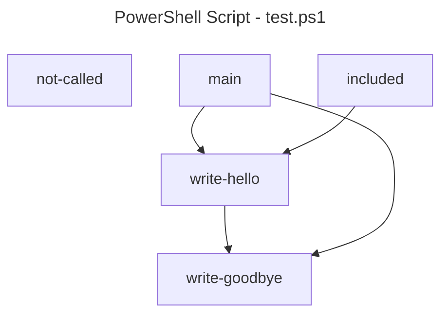

# PSCallGraph

## Overview
This script parses one or more powershell scripts and creates a call graph of functions called.  The graph is a mermaid diagram

## Usage
`pscallgraph -scriptFile sourcefile.ps1 -outputFile output.mermaid`

*scriptFile* - Comma separated list of files to create a call graph.  The script will import any dot-sourced files within the file.  All files are combined to create the same graph

*outputFile* - the output filename for the output

## Example

test.ps1
```powershell
<# This is a multiline comment
	that finishes here
#> 

# this is a comment

. include.ps1

function write-hello ($a, $b) {
	# a comment
	write-output "Hello"
	write-goodbye
}

function write-goodbye {
	write-output "Goodbye"
}

function not-called {
	write-output 'not called'
}

write-hello
write-goodbye
```

include.ps1
```powershell
function included {
	write-hello
}
```

Run `.\pscallgraph -scriptFile test.ps1 -outputFile test.mermaid`

`test.mermaid` will generate a mermaid graph as this



## License
The software is provided as is, where is.  Feel free to use and modify this code as you see fit.  I haven't looked at what type of license to release it under, but suffice to say do what you want with it.  